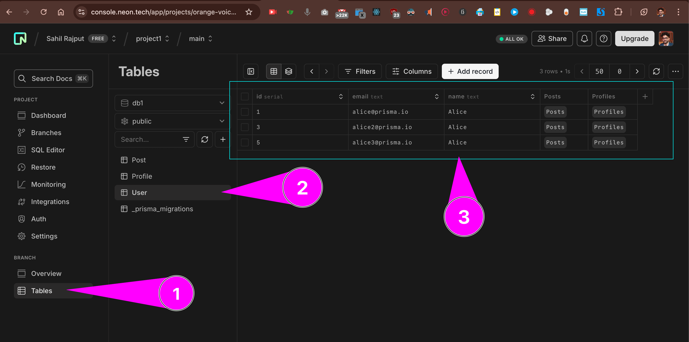

# README

Guide followed from - https://www.prisma.io/docs/getting-started/quickstart-sqlite

```bash
mkdir hello-prisma
cd hello-prisma
npm init -y
npm install typescript tsx @types/node --save-dev
npx tsc --init
npm install prisma --save-dev

npx prisma init
# OUTPUT:
# ✔ Your Prisma schema was created at prisma/schema.prisma
# You can now open it in your favorite editor.
# Next steps:
# 1. Set the DATABASE_URL in the .env file to point to your existing database. If your database has no tables yet, read https://pris.ly/d/getting-started
# 2. Set the provider of the datasource block in schema.prisma to match your database: postgresql, mysql, sqlite, sqlserver, mongodb or cockroachdb.
# 3. Run prisma db pull to turn your database schema into a Prisma schema.
# 4. Run prisma generate to generate the Prisma Client. You can then start querying your database.
# 5. Tip: Explore how you can extend the ORM with scalable connection pooling, global caching, and real-time database events. Read: https://pris.ly/cli/beyond-orm
#
# More information in our documentation:
# https://pris.ly/d/getting-started

# Generate
npx prisma generate


# for development/testing
npx prisma db push
# for migration name: migration-1.0
```

## Output in neon.tech (serverless postgresql)


